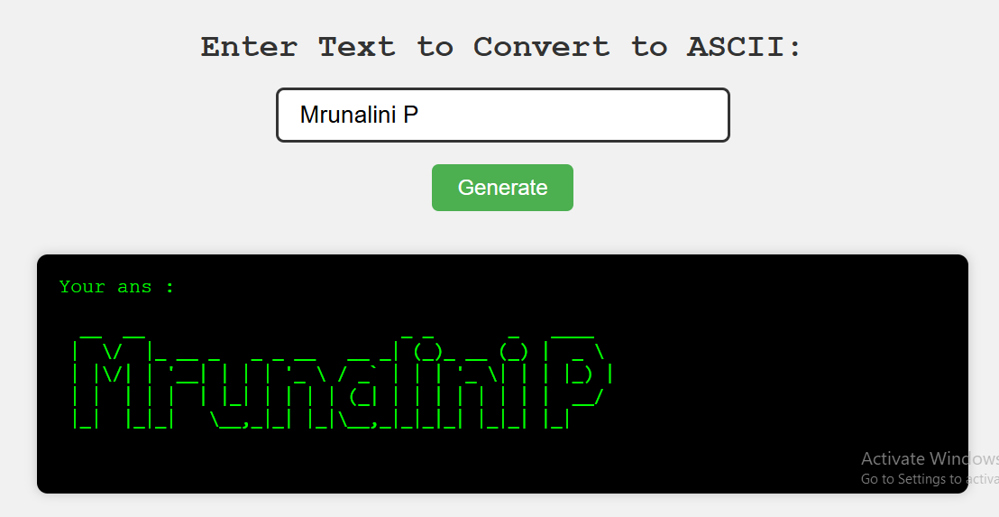

# 🎨 ASCII Art Generator

A fun and simple web app that converts any text into cool ASCII art using **Node.js**, **Express.js**, and the `figlet` library. Enter text in the browser, hit "Generate", and see your words turn into stylish terminal art!

---

## 🌟 Features

- 🔡 Input any custom text
- 💻 Converts it to ASCII-styled characters using Figlet
- ⚙️ Real-time backend processing via Express.js
- 🎨 Styled output displayed in-browser

---

Type → Hello

See →

 _   _      _ _
| | | | ___| | | ___
| |_| |/ _ \ | |/ _ \
|  _  |  __/ | | (_) |
|_| |_|\___|_|_|\___/

-----

  

